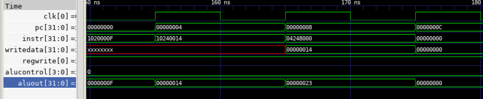

### Project Submission

# Instruction Set Architecture


# Overall design


This design use a program counter to determine which instruction to fetch from the instruction memory. Based on the instruction, the main decoder or the control would set certain values different variable which would in turn set up the computer to perform that instruction. The variable information are send over the datapath. Based on the type of instruction it is, different components of the computers are in use. There are 3 types of instruction, arithmetic, immediate and jump types. After each instruction, the program counter would be incremented by 4 to point at the next instruction, with the exception of jump instructions. The main component of the computer are the registers which would be used for calculation, the alu doing the calculations, and the data memory storing the data.

# Timing diagrams
note: the timing diagrams are pulled from sample codes that were ran. The outputs of the code are appended on the bottom. 
Running the following code after compiling would allow you to see more of the timing diagram.

```
make display 
```

R - type timing and I - type timing diagram

Instruction at pc 0x00000004 is I - type
Instruction at pc 0x00000008 is R - type

J - type timing


Mem - type timing


In order to run a given code on this design, the code must be writing in machine language in file within the /catalog/computer folder. The code should be written in hex. each line of instruction should following the format outlined in the ISA above.
Within the catalog/imem/imem.sv file, the file name must be replaced with the new file name. 
To run the program, one must be in the catalog/computer folder.
Running the following command compiles the program

```
make compile
```
The following command runs the file
```
make simulate
```
The following command displays the waveforms
```
make display
```

# Example output of code
Unfortunately, the design implemented is unable to jump to a register value, thus making a recursive function was difficult. To showcase the computer working, a loop function which works very similar to a recursive function was used. The function take a value and loops itself to sum up all the integers between itself and zero inclusively.
This function is in the file 
'''
function_exe
'''
The function takes in a value, which is currently set to 4 and loops over itself until it all up and stores it in $v0. The correct result is $v0 = 10.
Note: if one wishes to calculate a higher number, increase the running time of the computer in the tb.


# Outputs of Sample codes 
Note: the machine language of all code used could be found in a _exe file in the computer folder. The conversion between assembly to machine could be found in sample_notes


